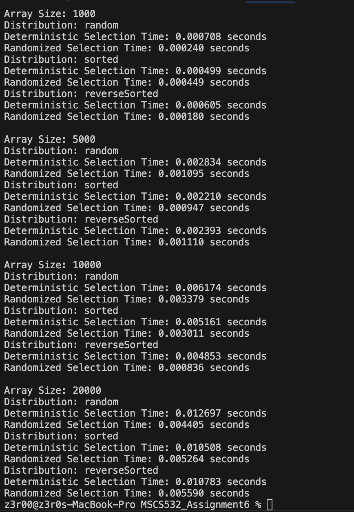
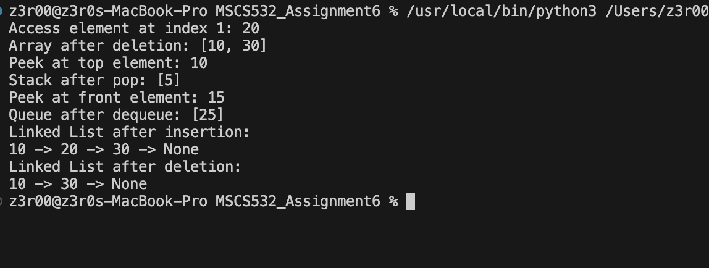

                 Part 1: Implementation and Analysis of Selection Algorithms

FileName: median.py

Overview: The file contains algorithms to find the k^th smallest element in an array. Two specific algorithms will be implemented:
Deterministic selection algorithm which guarantees O(n) time complexity in the worst case.
Randomized selection algorithm which provides an expected O(n) time complexity.

Output:  To get the output of the code, simply run the code in VSC. This output helps in the empirical analysis of the algorithms.Below is the screenshot of the output:

                Part 2: Elementary Data Structures Implementation and Discussion

FileName: dataStruc.py

Overview: The file is for implementing basic data structures like arrays, stacks, queues, and linked lists.

Output:  To get the output of the code, simply run the code in VSC. Below is the screenshot of the output:

